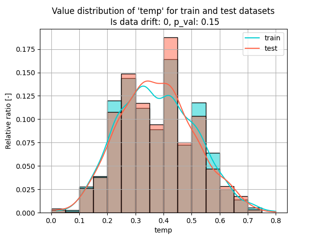
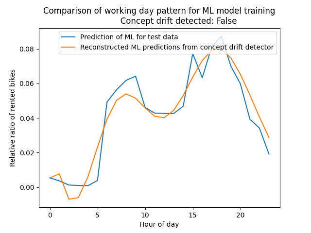
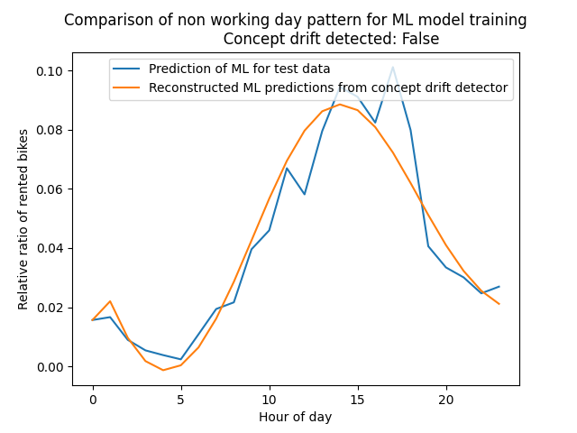
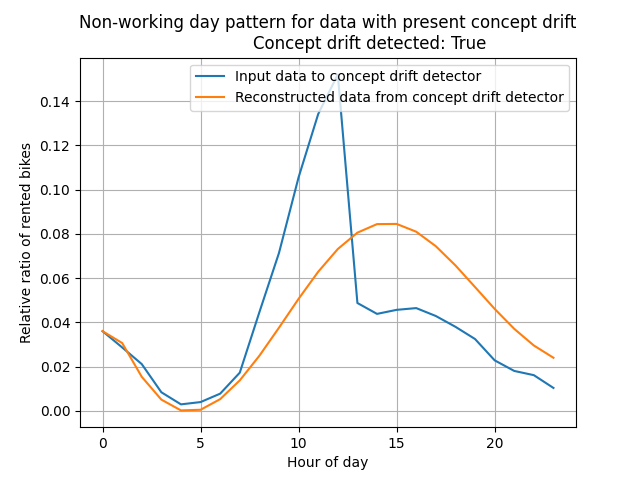
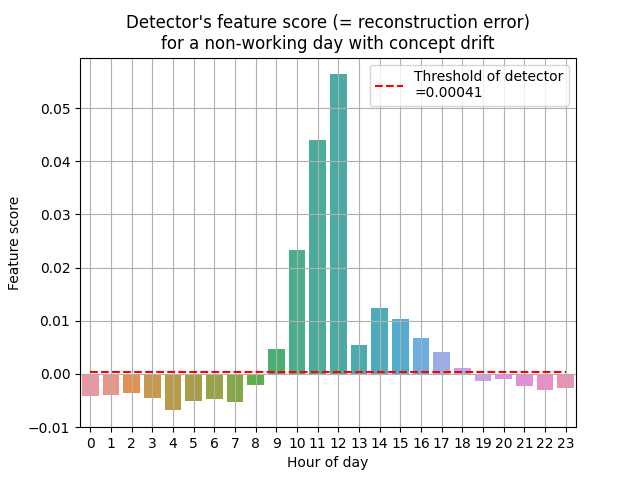

# TODO: Update readme.

# Data-validation-scenario

Please, see the blog post at ... for a full explanation.

There is a large boom of ML systems deployed to production these days. This
brings many demands to ML engineers. ML pipeline automation is possibly the most
important one. However, there is also one less known but very important aspect.
That is the validation of inputs and outputs of the ML system. In fact, data
validation is listed as one of
the [hidden technical debts](https://proceedings.neurips.cc/paper/2015/file/86df7dcfd896fcaf2674f757a2463eba-Paper.pdf)
in machine learning systems. There is a long history of projects that end up in
a disaster and that could be most likely saved by a proper data validation
process.

In this repository, we show how we may integrate data drift
detection ([alibi-detect](https://github.com/SeldonIO/alibi-detect) library)
with [DVC](https://dvc.org/) into the ML system and how is DVC beneficial in it.
We demonstrate the drift detection in two use cases:

- Detection of covariate shift between train and test datasets.
- Detection of concept drift in the input data.

We refer to an
excellent [Data Distribution Shifts and Monitoring post](https://huyenchip.com/2022/02/07/data-distribution-shifts-and-monitoring.html)
for a detailed overview and precise definition of covariate shift and concept
drift.

### Technical requirements

The core functionalities are comming from `dvc` and `alibi-detect`
(has `tensorflow` dependency) libraries.

The project is tested with Python 3.7 and higher.

### Instructions to run the project

1. Clone the repository
    ```commandline
    git clone https://gitlab.com/iterative.ai/cse/solutions/data-validation-scenario.git
    ```
2. Change folder
    ```commandline
    cd data-validation-scenario
    ```
3. Create virtual environment and activate it
    ```commandline
    python -m venv .venv
    source .venv/bin/activate
    ```
4. Activate the virtual environment and install all the required libraries
    ```commandline
    pip install -r requirements.txt
    ```
5. Now, you can run the pipeline with `dvc` commands.
    ```commandline
    dvc repro
    ```

## Description of the project

### Dataset

A dataset in the project is the same as the used in
the [Stale model blogpost](https://dvc.org/blog/stale-models), that is bike
sharing dataset you can either manually
download [online](https://archive.ics.uci.edu/ml/machine-learning-databases/00275/Bike-Sharing-Dataset.zip)
or you can let the pipeline download it for you.

The dataset covers bike sharing services for the years 2011-2012 aggregated on a
daily and hourly basis. We will focus on hourly basis aggregation. The detailed
description of the features is in the readme document in the dataset zip file.

### ML Model

The main focus of this project shall be a demonstration of drift detection,
therefore, we have decided to use a simple off-the-shelf ML model, without any
thought-out preprocessing steps. We acknowledge that performance of the ML model
could be better if we would pay more attention to these steps.

### Data drift detector

This project uses a popular
library [alibi-detect](https://docs.seldon.io/projects/alibi-detect/en/latest/overview/algorithms.html)
that comprises several powerful algorithms for the detection of both outliers
and data drift.

The dataset that we are using is a tabular dataset that consists of both
continuous numerical features and categorical features. Various drift detectors
handle this setting. We have decided to
use [The Maximum Mean Discrepancy (MMD)](https://docs.seldon.io/projects/alibi-detect/en/latest/cd/methods/mmddrift.html)
the detector as it is popular, easy to use and gives good results in our use
case.

There are patterns in how bikes are rented throughout the day. We detect changes
in these patters
with [Seq2Seq detector](https://docs.seldon.io/projects/alibi-detect/en/latest/examples/od_seq2seq_ecg.html)
.

### DVC pipeline

There are two `dvc.yaml` files in the repository.

The first `dvc.yaml` file is located in the root of the repository and consists
of the following stages:

- *data_preparation* - This stage downloads data if not already present and
  preprocesses them according to the configuration.
- *model_training* - This stage trains a simple RandomForrestClassifier model.
- *covariate_drift_detector_training* - This stage trains a covariate drift
  detector.
- *concept_drift_detector_training* - This stage trains a concept drift
  detector.
- *evaluation* - This stage evaluates the performance of the model and if there
  is a drift in the training/test dataset split.

The second `dvc.yaml` file is located in the `concept_drift_demo` folder and it
shall reproduce the business scenario when there starts a new competition (
please see the blog post for more information). This file has only two stages:

- *data_preparation_cd_demo* - This stage modifies the original dataset and
  artificially creates concept drift in the data.
- *evaluation_cd_demo* - This stage evaluates if there is a concept drift in the
  input data.

## Scenarios

We demonstrate the drift detection in the following scenarios.

### 1) Validation of training/test split

Let's imagine we have collected bike sharing data for two months (March and
April) and we would like to know a good strategy for splitting this data into
training and test datasets. There are many possibilities for how to achieve
that. Two intuitive strategies would be: a) use March data for training and
April data for testing, or, b) take both months and randomly split the data.

You can run this pipeline with

```bash
dvc repro
```

Below, you can see a graph that was generated by the pipeline. It is a
combination of two histogram plots
(for training and test data) of feature `temp`. On the horizontal axis is a
value of the `temp` feature. It ranges from 0 to 1 because it is normalized in
the dataset. On the vertical axis is a relative prevalence of the bin. This
prevalence is also normalized meaning that the sum of all bins for one dataset
is equal to 1.



### 2) Validation of concept drift

Concept drift occurs when there is a change in the pattern that the ML model
learns and new data. We detect this by training a detector on a historical 15
months of data. From this historical data, we have learned that there are two
bike-rental patterns, one for a working day and one for a non-working day. We
have trained
a [Seq2Seq detector](https://docs.seldon.io/projects/alibi-detect/en/latest/examples/od_seq2seq_ecg.html)
to detect if this pattern changes over time.

You can run this pipeline with

```bash
$ dvc repro concept_drift_demo/dvc.yaml
```

The graphs that we can see below represent a bike-rental pattern in the data.
There are two graphs, one for a working day and one for a non-working day. On
the horizontal axis is an hour of a day. On the vertical axis is a relative
ratio of rented bikes. The relative ratio is calculated by dividing the number
of rented bikes in the hour by the total number of rented bikes per day.

There are two signals in the graphs. The blue line represents a pattern that we
can see in the data. The orange line is an output of the concept drift detector.
The closer the two lines are the better.




Now, imagine the following scenario. We trained our ML model on March and April
data and it worked fine at the beginning of May. But then, a new competitor in
the area starts to offer significant discounts for afternoon hours during
weekends. This will have a tremendous effect on the number of rented bikes.
Estimate says that this decreased the number of rented bikes by 70%.

This type of scenario is a typical example of concept drift. We can detect this
concept drift with our detector as shown in the following figure. The blue line
is the measured number of rented bikes in the first week of May and is the input
to the concept drift detector. The orange line is the reconstructed pattern from
the detector. We can see that there is quite a significant between these two
signals and we can also see that the drift was detected.



The reconstruction error (called feature score in this case) can be further seen
in the following graph


